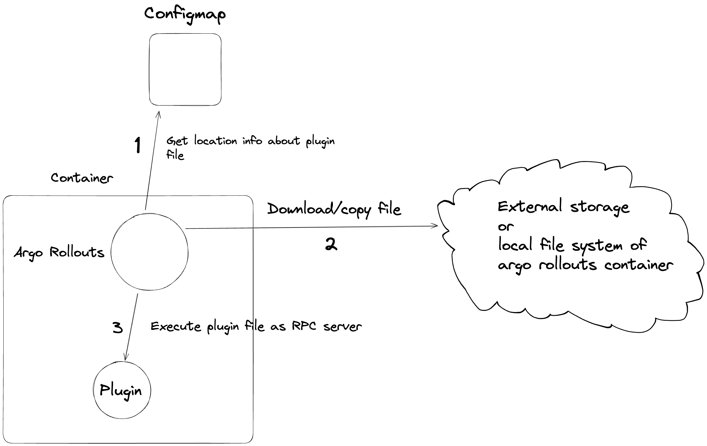

# Contributing

This guide shall help you in setting up your build & test environment, so that you can start developing and testing bug fixes and feature enhancements without having to make too much effort in setting up a local toolchain.

## Before You Start
The Gateway Plugin for Argo Rollouts is written in Golang. If you do not have a good grounding in Go, try out [the tutorial](https://tour.golang.org/).

## Pre-requisites

Install on your local workstation:

* [docker](https://docs.docker.com/install/#supported-platforms)
* [golang](https://golang.org/)
* [kubectl](https://kubernetes.io/docs/tasks/tools/#kubectl)
* [kustomize](https://github.com/kubernetes-sigs/kustomize/releases) >= 4.5.5
* A local Kubernetes cluster. We recommend [k3d](https://k3d.io/) 


Checkout the code:

```bash
git clone https://github.com/argoproj-labs/rollouts-plugin-trafficrouter-gatewayapi.git
cd rollouts-plugin-trafficrouter-gatewayapi
```

## Argo Rollouts plugin system architecture

The Argo Rollouts Gateway API plugin needs the main Argo Rollouts controller to work. 

When the Argo Rollouts controller starts, it reads the ConfigMap named `argo-rollouts-config` (from the namespace in which controller is located) from the API server of the k8s cluster it is running on.

If this configmap is present, the Argol Rollouts controller validates its content and then loads the plugin that is defined there. It is important to understand that this process happens only at the beginning and **only once** during the controller startup. ,

This means that if you change the `argo-rollouts-config` configmap or if you create it after the Argo Rollouts controller is already up you will need to restart the controller for the changes to take effect. 

The Argo Rollouts Controller uses this config map to understand where to load its plugins from. When Argo Rollouts learns their locations it downloads and executes them as separate RPC servers in the same pod. When the controller detects [specific Rollout events](https://argo-rollouts.readthedocs.io/en/stable/features/specification/), for example events corresponding to the `SetWeight` action, it makes specific remote procedure calls to the respective RPC server and waits for a response. 

Here is a diagram illustrating the main aspects of architecture:



For more information about Argo Rollouts plugins please read

* [https://argo-rollouts.readthedocs.io/en/latest/plugins/](https://argo-rollouts.readthedocs.io/en/latest/plugins/)
* [https://argo-rollouts.readthedocs.io/en/latest/features/traffic-management/plugins/](https://argo-rollouts.readthedocs.io/en/latest/features/traffic-management/plugins/)


## Project dependencies

The project is using Go modules. 
See all dependencies in the `go.mod` file. The usual `go build/test` commands will automatically install the needed dependencies in your local workspace.

## Building the plugin

We have 2 targets in the [Makefile](https://github.com/argoproj-labs/rollouts-plugin-trafficrouter-gatewayapi/blob/main/Makefile):

1. `local-build` - This is the main makefile target you will use during development. This creates raw/unoptimized binaries that keep the link symbols so that you can use a Go debugger while you change your code.
2. `gateway-api-plugin-build` - This makefile target creates an optimized build binary for a production release. This target is currently run by Continuous integration to create releases. You should normally not need this target during development


## Running the plugin Locally

To start developing the plugin do the following


1. Start your local Kubernetes cluster
1. Create a ConfigMap named `argo-rollouts-config` in the namespace of Argo Rollouts controller. We will run it locally so its namespace will be `default`
2. Run `make local-build` to create a local build of the plugin binary. In the `argo-rollouts-config` manifest specify the path to this local build by using a file directive
```
file://<path to the local build>
```
3. Install required CRDs for Argo Rollouts deploy the controller. For that you can run
```bash
kubectl create namespace argo-rollouts
kubectl apply -n argo-rollouts -f https://github.com/argoproj/argo-rollouts/releases/latest/download/install.yaml
```
After that delete the in cluster Argo Rollouts controller deployment as we will run controller locally (We only needed the CRDs).
4. Run locally the Argo Rollouts controller
```bash
cd ~/go/src/github.com/argoproj/argo-rollouts
go run ./cmd/rollouts-controller/main.go
```
5. If you followed all instructions correctly, the Argo Rollouts controller will find your local build of your plugin and will run it as an RPC server locally. You have the ability to debug the plugin like any other Golang application. Any Goland Debugger that has the ability to attach to a local process can be used to place breakpoints on your code.

## Making releases

1. Write in **/RELEASE_NOTES.md** the description of the future release
2. Create a tag in the `main` branch 
```bash
git tag release-v[0-9]+.[0-9]+.[0-9]+
```
If you prefer to make pre-release run
```bash
git tag release-v[0-9]+.[0-9]+.[0-9]+-rc[0-9]+
```
3. Push the tag to the remote repository
4. The pushed tag will trigger [a GitHub actions workflow](https://github.com/argoproj-labs/rollouts-plugin-trafficrouter-gatewayapi/blob/main/.github/workflows/release.yaml) that will create a corresponding tag `v[0-9]+.[0-9]+.[0-9]+` or `v[0-9]+.[0-9]+.[0-9]+-rc[0-9]+` and will then delete your tag. Therefore after pushing the tag to the remote repository you also need to delete it locally. When the workflow has finished its work you can run **git pull** and you will see new tag.

## Running Unit Tests

To run unit tests:
```bash
make test
```

## Running E2E tests

The e2e tests need to run against a kubernetes cluster with the Argo Rollouts controller. To run e2e tests run in the repository root

```
make e2e-tests
```

This command will
1. Create local cluster **gatewayapi-plugin-e2e** using tools [kind](https://kind.sigs.k8s.io/) and [docker](https://www.docker.com/). You need to install them.
2. Setup cluster using instruments [helm](https://helm.sh/) and [kubectl](https://kubernetes.io/docs/reference/kubectl/). You need to install them.
3. Runs tests in **/test/e2e** folder. 
4. Delete all resources from created cluster.
5. Delete created cluster.

If you want to leave working cluster with needing setup at the end you should run the following command
```
make CLUSTER_DELETE=false e2e-tests
```

## Creating a Pull Request

When you have finished implementing your feature, you need to create a Pull Request in GitHub.

You need to sign-off your commit using DCO (Developer Certificate of Origin). Read [the guide](https://github.com/src-d/guide/blob/master/developer-community/fix-DCO.md) if you don't know how to do that.

Please use [meaningful PR names](https://www.conventionalcommits.org/en/v1.0.0/) for the Pull request title.

When you submit a PR, a couple of CI checks will be run automatically to ensure your changes will build fine and meet certain quality standards. Your contribution needs to pass those checks in order to be merged into the repository.

## Documentation Changes

Install Docker locally.
Modify documentation contents in the `docs/` directory.

You can preview changes in your browser by visiting http://localhost:8000 after running:

```shell
make serve-docs
```

<!-- To publish changes, run:

```shell
make release-docs
``` -->
