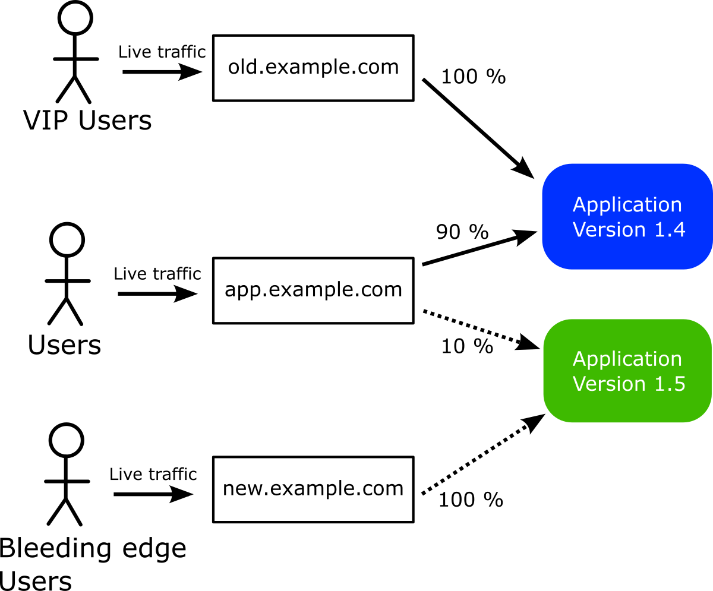
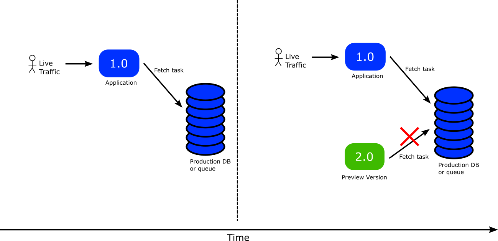
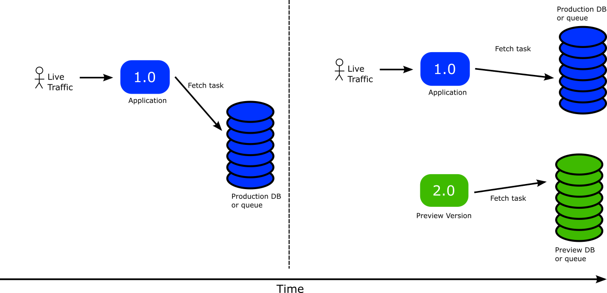
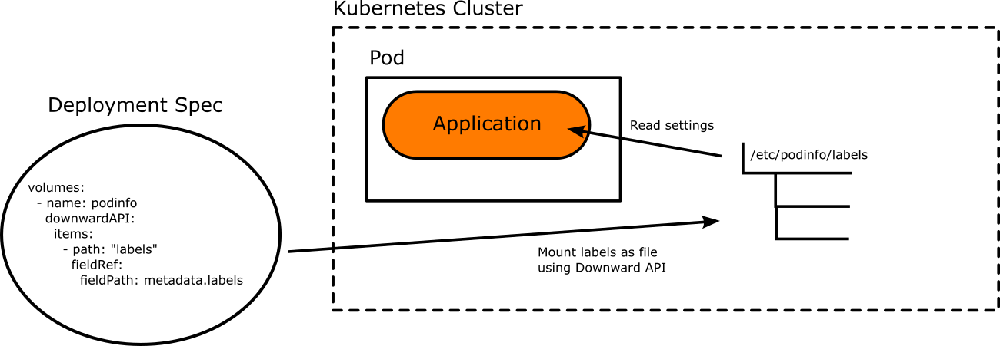

# Advanced Deployment methods

Once you have the basic canary deployment in place, you can explore
several other deployment scenarios with more flexible routing options. 

## Scenario - pinning clients to a specific version

Sometimes you have some special clients (either humans or other services) which you consider critical and want to stay in the stable version as long as possible even if a canary is in progress.

On the other end of the spectrum you might have some users that want to see the new versions as soon as possible (e.g. internal company users).

There are many ways to achieve this, but one of the most simple scenarios is to use additional HTTP routes that point only to a specific service.



In the example above, VIP users connect to `old.example.com` and always see the previous version. Bleeding edge users connect to `new.example.com` and see the new version as soon as the canary starts (for 100% of their traffic). Everybody else connects to `app.example.com` and sees the canary
according to the current percentage of the rollout.


Here is definition for the 3 HTTP routes.

```yaml
---
kind: HTTPRoute
apiVersion: gateway.networking.k8s.io/v1beta1
metadata:
  name: canary-route
  namespace: default
spec:
  parentRefs:
    - name: eg
  hostnames:
    - app.example.com  
  rules:
  - matches:
    - path:
        type: PathPrefix
        value: /
    backendRefs:
    - name: argo-rollouts-stable-service
      kind: Service
      port: 80
    - name: argo-rollouts-canary-service
      kind: Service
      port: 80
---
kind: HTTPRoute
apiVersion: gateway.networking.k8s.io/v1beta1
metadata:
  name: always-old-version
  namespace: default
spec:
  parentRefs:
    - name: eg
  hostnames:
    - old.example.com     
  rules:
  - matches:
    - path:
        type: PathPrefix
        value: /
    backendRefs:
    - name: argo-rollouts-stable-service
      kind: Service
      port: 80
---
kind: HTTPRoute
apiVersion: gateway.networking.k8s.io/v1beta1
metadata:
  name: always-new-version
  namespace: default
spec:
  parentRefs:
    - name: eg
  hostnames:
    - new.example.com     
  rules:
  - matches:
    - path:
        type: PathPrefix
        value: /  
    backendRefs:
    - name: argo-rollouts-canary-service
      kind: Service
      port: 80            
```      

This defines the following routes

1. `canary-route` at host `app.example.com` sees canary as current percentage (2 backing services)
1. `always-old-version` at host `old.example.com` sees always old/stable version (1 backing service)
1. `always-new-version` at new `app.example.com` sees always new/unstable version (1 backing service)

Then in your Rollout manifest you only mention the "canary-route" HTTPRoute. This is the only route that Argo Rollouts will manage. The other 2 routes will always stay the same (always old or always new version) regardless of what the canary is doing.

```yaml
apiVersion: argoproj.io/v1alpha1
kind: Rollout
metadata:
  name: static-rollouts-demo
spec:
  replicas: 5
  strategy:
    canary:
      canaryService: argo-rollouts-canary-service 
      stableService: argo-rollouts-stable-service 
      trafficRouting:
        plugins:
          argoproj-labs/gatewayAPI:
            # only the canary route is managed by Argo rollouts
            httpRoute: canary-route 
            namespace: default # namespace where this rollout resides
      steps:
        - setWeight: 10
        - pause: {}
        - setWeight: 50
        - pause: { duration: 10 }
  revisionHistoryLimit: 2
  selector:
    matchLabels:
      app: static-rollouts-demo
  template:
    metadata:
      labels:
        app: static-rollouts-demo
    spec:
      containers:
        - name: static-rollouts-demo
          image: kostiscodefresh/summer-of-k8s-app:v1       
          ports:
            - name: http
              containerPort: 8080
              protocol: TCP

```
When a canary is not in progress then all clients see the same/active version without any further changes.

## Scenario - making applications "canary-aware"

Another advanced use case is when you want smarter applications that act differently depending on the current state of the rollout process.

Under normal circumstances an application doesn't know if it is part of canary or not. This is normally not a problem when all your applications are stateless and communicate via HTTP calls.

However several times your applications interact with stateful stores such as databases or queues. In that case if you launch a canary with default settings it will instantly interact with your production database/queue which is something that you might now want.

A classic example is when you want to launch a canary version of a queue worker. The moment you launch it will start picking tasks from your production queue. So simply "redirecting" 10% traffic to it does not actually mean that it will pick 10% of tasks.



Ideally you would like to have full control and "tell" the application
that it is running under canary mode. This will make adjust its behavior.
For example you could instruct the application to pick task from a different queue while it is part of a canary.



This can be achieved with 3 different components

1. The [Kubernetes downward api](https://kubernetes.io/docs/concepts/workloads/pods/downward-api/)
1. [Argo Rollouts ephemeral labels](https://argo-rollouts.readthedocs.io/en/stable/features/ephemeral-metadata/)
1. Application code that reads configuration from files.

The Kubernetes downward API allows you to mount resource labels as files in your application. Argo Rollouts ephemeral labels allow you to put special labels in a pod resource only for the duration of the canary.



This means that while the canary is running the application can have different settings from the stable version. It is possible to read data from different data store or serve different results to the canary users.

The last piece of the puzzle is for the application code to reload its configuration when the canary is fully promoted. This means that once the canary becomes the new stable version, all settings should be changed to "production" ones.

There are different libraries for each programming language to achieve this.

* [Viper Conf](https://github.com/spf13/viper) (Golang)
* [RefreshScope](https://cloud.spring.io/spring-cloud-static/spring-cloud.html#_refresh_scope) (Spring/Java)
* [chokidar](https://github.com/paulmillr/chokidar)/config (Node.js)
* [configparser](https://pypi.org/project/configparser/)/[watchdog](https://pypi.org/project/watchdog/) (Python)
* yaml/[listen](https://github.com/guard/listen) (Ruby)
* config/[watchservice](https://developer.android.com/reference/kotlin/java/nio/file/WatchService) (Kotlin)
* config/[config-watch](https://docs.rs/config/latest/config/) (Rust)

Here is an example of a Rollout that uses this feature

```yaml
apiVersion: argoproj.io/v1alpha1
kind: Rollout
metadata:
  name: rollouts-demo
  namespace: default
spec:
  replicas: 5
  strategy:
    canary:
      canaryService: argo-rollouts-canary-service 
      stableService: argo-rollouts-stable-service 
      activeMetadata:
        labels:
          rabbitHost: rabbitmq
          rabbitPort: "5672"
          role: active
          rabbitQueue: myProductionQueue
      previewMetadata:
        labels:
          rabbitHost: rabbitmq
          rabbitPort: "5672"
          role: preview
          rabbitQueue: myPreviewQueue       
      trafficRouting:
        plugins:
          argoproj-labs/gatewayAPI:
            httpRoute: argo-rollouts-http-route 
            namespace: default
      steps:
      - setWeight: 10
      - pause: {}
      - setWeight: 100
      - pause: {}
  revisionHistoryLimit: 2
  selector:
    matchLabels:
      app: rollouts-demo
  template:
    metadata:
      labels:
        app: rollouts-demo
    spec:
      containers:
        - name: rollouts-demo
          image: <my-image:my-tag>
          ports:
            - name: http
              containerPort: 8080
              protocol: TCP
          volumeMounts:
            - name: podinfo
              mountPath: /etc/podinfo                 
      volumes:
        - name: podinfo
          downwardAPI:
            items:
              - path: "labels"
                fieldRef:
                  fieldPath: metadata.labels              
```

This Rollout passes different RabbitMQ settings to the canary application.
The settings will be available to the pod in a file at `/etc/podinfo/labels` where the source code will need to read them.

The file will contain the labels in the following format

```
role="preview"
rabbitHost=localhost
rabbitPort=5672
rabbitQueue=myProductionQueue
```

You can easily read this file with your favorite programming language into a settings object.
