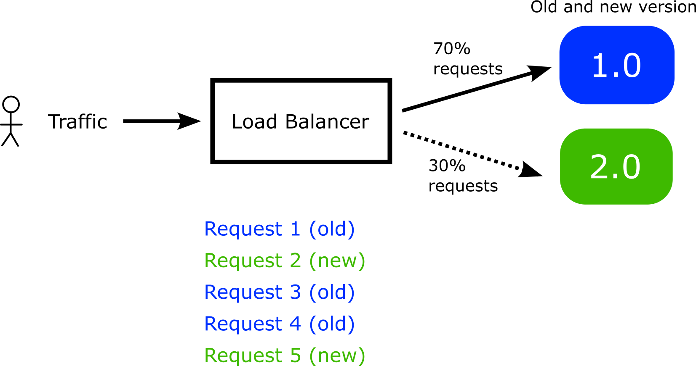
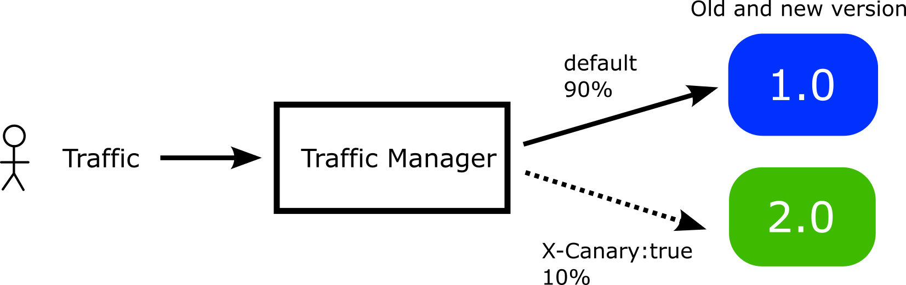
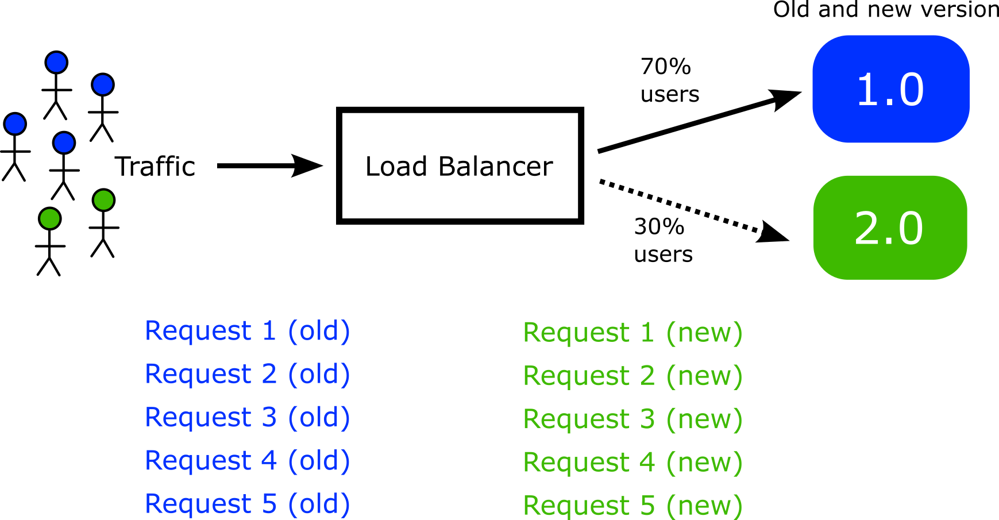

# Header Based routing

When you want to isolate the behavior of clients that connect to a canary, you can simply use a different http route as explained in [Advanced Deployments](advanced-deployments.md).

An alternative method is to use HTTP headers that distinguish which clients connect to the canary and which do not.

## How Header based routing works

By default when Argo Rollouts sends new traffic to canary pods, this happens on the request level and it is completely random.



This means that you cannot predict which requests from a single user will go the canary pods and which will go to the stable pods. This can be a big issue if the rollout represents an end-user application with a web based interface.

For example, if the new version has different colors on the web page buttons or different elements, a single user might see a different graphical interface each time they request the page.

To overcome this issue you can get full control over which requests go to the canary pods by using a special [HTTP header](https://datatracker.ietf.org/doc/html/rfc2616#section-4.2). This instructs Argo Rollouts to always sends requests to the canary pods if this special header is present. 



Therefore you have the power to direct specific users to the canary instead of just random requests. There are several ways to inject custom headers in your network calls

1. Several network products (load balancers, proxies, firewalls etc.) can inject and process HTTP headers
1. You can have the application itself inject HTTP headers on its own requests
1. You can instruct other applications that call the canary application to use HTTP headers when they communicate with it.



The end result is that instead of having random requests go to canary pods, you can now decide exactly which users will see the canary pods.

## Using a custom header with a single route

!!! important
    Your [Gateway API provider](https://gateway-api.sigs.k8s.io/implementations/) must also support Header based routing before you can activate it in a Rollout manifest.

Here is an example of a rollout that uses headers 
for the canary:

```yaml
apiVersion: argoproj.io/v1alpha1
kind: Rollout
metadata:
  name: rollouts-demo
  namespace: default
spec:
  replicas: 5
  strategy:
    canary:
      canaryService: argo-rollouts-canary-service 
      stableService: argo-rollouts-stable-service 
      trafficRouting:
        managedRoutes:
        - name: canary-route1
        - name: canary-route2
        plugins:
          argoproj-labs/gatewayAPI:
            httpRoutes:
              - name: argo-rollouts-http-route
                useHeaderRoutes: true
            namespace: default
      steps:
      - setWeight: 10
      - setHeaderRoute:
          name: canary-route1
          match:
            - headerName: X-Canary-start
              headerValue:
                exact: ten-per-cent      
      - pause: {}      
      - setWeight: 50
      - setHeaderRoute:
          name: canary-route2
          match:
            - headerName: X-Canary-middle
              headerValue:
                exact: half-traffic      
      - pause: {}
      - setWeight: 100
      - pause: {}
  revisionHistoryLimit: 2
  selector:
    matchLabels:
      app: rollouts-demo
  template:
    metadata:
      labels:
        app: rollouts-demo
    spec:
      containers:
        - name: rollouts-demo
          image: <your-image:your-tag>
          ports:
            - name: http
              containerPort: 8080
              protocol: TCP
```              

This manifest instructs Argo Rollouts to do the following:

1. Create 2 **brand new** HTTP routes called `canary-route1` and `canary-route2`
1. The first route will be created on the fly when the canary is at 10% traffic. The second when the canary is at 50% traffic.
1. These routes will be cloned/copied from the provided `argo-rollouts-http-route`
1. Both of these 2 routes will always point to the canary pods
1. All requests with an HTTP header `X-Canary-start: ten-per-cent` will be sent to the first route while all requests with an http header `X-Canary-middle:half-traffic` will be sent to the second route

Notice that the route names used for headers in `setHeaderRoute` must also be defined in the `managedRoutes` block as well.

Now when the canary reaches 10% an extra route will be created that uses the `X-Canary-start` header with value `ten-per-cent`. When the canary reaches 50% a different header route will be created. At the end of the canary all header routes are discarded.

These smart routes will be created by Argo Rollouts and will be destroyed automatically when the rollout has finished. In your manifests you only need to provide the `argo-rollouts-http-route` definition. See also the [HTTP routing](https://gateway-api.sigs.k8s.io/guides/http-routing/) documentation.

## Using multiple routes with headers

It is also possible to combine [multiple routes](multiple-routes.md) with custom headers.

Here is an example

```yaml
apiVersion: argoproj.io/v1alpha1
kind: Rollout
metadata:
  name: rollouts-demo
spec:
  replicas: 4
  revisionHistoryLimit: 2
  selector:
    matchLabels:
      app: rollouts-demo
  strategy:
    canary:
      stableService: stable-service
      canaryService: canary-service
      trafficRouting:
        managedRoutes:
          - name: header-route
          - name: header-route2
        plugins:
          argoproj-labs/gatewayAPI:
            namespace: default                                  
            httpRoutes:
              - name: http-route
                useHeaderRoutes: true
              - name: http-route2
                useHeaderRoutes: true
              - name: http-route3
      steps:
      - setWeight: 20
      - pause: {duration: 10}
      - setWeight: 40
      - pause: {duration: 20}
      - setWeight: 60
      - setHeaderRoute:
          name: header-route
          match:
            - headerName: X-Test
              headerValue:
                exact: test
      - pause: {duration: 10}
      - setHeaderRoute:
          name: header-route2
          match:
            - headerName: X-Test2
              headerValue:
                exact: test
      - pause: {}
      - setWeight: 80
      - setHeaderRoute: # remove header route
          name: header-route
      - pause: {}
  template:
    metadata:
      labels:
        app: rollouts-demo
    spec:
      containers:
      - name: rollouts-demo
        image: <your-image:your-tag>
        ports:
        - name: http
          containerPort: 8080
          protocol: TCP      
```    

With the `useHeaderRoutes` variable you can decide which routes
will honor the custom headers.

## Full example with Header based routing and Argo Rollouts

For a complete example with header based routing see our [LinkerD example](https://github.com/argoproj-labs/rollouts-plugin-trafficrouter-gatewayapi/tree/main/examples/linkerd-header-based).