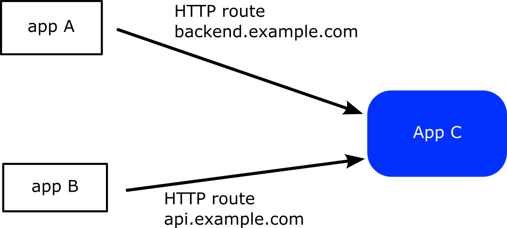

# Using Multiple Routes

The Gateway plugin can control more than one HTTP routes during a canary.
This is a very common scenario if you have micro-services and the same application can be accessed by different routes.




As an  example you have application A that uses application C at `backend.example.com` while application B also depends on C but this time as `api.example.com`

You want to perform a canary deployment for application C so it is crucial that during the canary both HTTP routes change weights.

First you define the two HTTP routes

```yaml
---
kind: HTTPRoute
apiVersion: gateway.networking.k8s.io/v1beta1
metadata:
  name: backend-route
  namespace: default
spec:
  parentRefs:
    - name: eg
  hostnames:
    - backend.example.com
  rules:
  - matches:
    - path:
        type: PathPrefix
        value: /
    backendRefs:
    - name: argo-rollouts-stable-service
      kind: Service
      port: 80
    - name: argo-rollouts-canary-service
      kind: Service
      port: 80
---
kind: HTTPRoute
apiVersion: gateway.networking.k8s.io/v1beta1
metadata:
  name: api-route
  namespace: default
spec:
  parentRefs:
    - name: eg
  hostnames:
    - api.example.com
  rules:
  - matches:
    - path:
        type: PathPrefix
        value: /
    backendRefs:
    - name: argo-rollouts-stable-service
      kind: Service
      port: 80
    - name: argo-rollouts-canary-service
      kind: Service
      port: 80
```

Then in your Rollout definition you use the `httproutes` property that
accepts a list of routes to be controlled.

```yaml
apiVersion: argoproj.io/v1alpha1
kind: Rollout
metadata:
  name: rollouts-demo
  namespace: default
spec:
  replicas: 5
  strategy:
    canary:
      canaryService: argo-rollouts-canary-service
      stableService: argo-rollouts-stable-service
      trafficRouting:
        plugins:
          argoproj-labs/gatewayAPI:
            httpRoutes:
              - name: backend-route
              - name: api-route
            namespace: default
      steps:
      - setWeight: 10
      - pause: {}
      - setWeight: 50
      - pause: {}
      - setWeight: 100
      - pause: {}
  revisionHistoryLimit: 2
  selector:
    matchLabels:
      app: rollouts-demo
  template:
    metadata:
      labels:
        app: rollouts-demo
    spec:
      containers:
        - name: rollouts-demo
          image: <my-image:my-tag>
          ports:
            - name: http
              containerPort: 8080
              protocol: TCP
```

If you now start a canary deployment both routes will change to 10%, 50% and 100% as the canary progresses to all its steps.

### Working with GitOps controllers

GitOps tools such as Argo CD continuously reconcile Gateway API resources and can revert the temporary weight changes that occur
while a canary is progressing. The plugin automatically adds the label
`rollouts.argoproj.io/gatewayapi-canary=in-progress` to every HTTPRoute/GRPCRoute/TCPRoute/TLSRoute it mutates so that you can
configure your GitOps policy to ignore those resources during a rollout. The label disappears as soon as the stable service
returns to 100% weight. You can customise the key/value or disable the feature altogether with the
`inProgressLabelKey`, `inProgressLabelValue` and `disableInProgressLabel` fields under the plugin configuration.

#### Argo CD `ignoreDifferences`

When you use Argo CD (either through the Application CRD or its Helm chart), add the following snippet so that Argo CD skips the
temporary rule edits while the `rollouts.argoproj.io/gatewayapi-canary` label is present:

```yaml
configs:
  cm:
    resource.customizations.ignoreDifferences.gateway.networking.k8s.io_HTTPRoute: |
      jqPathExpressions:
        - if .metadata.labels["rollouts.argoproj.io/gatewayapi-canary"] == "in-progress" then .spec.rules
```

Duplicate the block for `GRPCRoute`, `TCPRoute` and `TLSRoute` if you manage those kinds as well. If you have customised the
label key or value on the plugin, update the `jqPathExpressions` condition to match your configuration. The same structure applies
when you configure `resource.customizations` directly on an Application manifest (outside of Helm).

## Automatic Route Discovery with Label Selectors

Instead of explicitly listing each route name, you can use label selectors to automatically discover routes. This is particularly useful when managing many routes or when routes are created dynamically.

### Using Label Selectors

You can configure the plugin to discover routes based on their labels:

```yaml
apiVersion: argoproj.io/v1alpha1
kind: Rollout
metadata:
  name: rollouts-demo
  namespace: default
spec:
  replicas: 5
  strategy:
    canary:
      canaryService: argo-rollouts-canary-service
      stableService: argo-rollouts-stable-service
      trafficRouting:
        plugins:
          argoproj-labs/gatewayAPI:
            httpRouteSelector:
              matchLabels:
                app: my-app
                canary-enabled: "true"
            namespace: default
      steps:
      - setWeight: 10
      - pause: {}
      - setWeight: 50
      - pause: {}
      - setWeight: 100
      - pause: {}
  # ... rest of rollout spec
```

With this configuration, the plugin will automatically discover and manage all HTTPRoutes in the namespace that have the labels `app: my-app` and `canary-enabled: true`.

### Labeling Your Routes

To use label selectors, add appropriate labels to your routes:

```yaml
---
kind: HTTPRoute
apiVersion: gateway.networking.k8s.io/v1beta1
metadata:
  name: backend-route
  namespace: default
  labels:
    app: my-app
    canary-enabled: "true"
spec:
  # ... route specification
---
kind: HTTPRoute
apiVersion: gateway.networking.k8s.io/v1beta1
metadata:
  name: api-route
  namespace: default
  labels:
    app: my-app
    canary-enabled: "true"
spec:
  # ... route specification
```

### Combining Explicit Routes and Selectors

You can combine both approaches - explicitly named routes and label selectors:

```yaml
trafficRouting:
  plugins:
    argoproj-labs/gatewayAPI:
      httpRoutes:
        - name: critical-route  # Explicitly managed
      httpRouteSelector:        # Plus all routes matching this selector
        matchLabels:
          auto-discover: "true"
      namespace: default
```

### Selector Types

The plugin supports selectors for different route types:

- `httpRouteSelector`: Discovers HTTPRoutes
- `grpcRouteSelector`: Discovers GRPCRoutes
- `tcpRouteSelector`: Discovers TCPRoutes

You can use multiple selectors simultaneously:

```yaml
trafficRouting:
  plugins:
    argoproj-labs/gatewayAPI:
      httpRouteSelector:
        matchLabels:
          protocol: http
      grpcRouteSelector:
        matchLabels:
          protocol: grpc
      namespace: default
```

### Advanced Selectors

You can use more complex label selectors with match expressions:

```yaml
httpRouteSelector:
  matchLabels:
    app: my-app
  matchExpressions:
  - key: environment
    operator: In
    values: ["production", "staging"]
  - key: team
    operator: Exists
```

This selector will match routes that:
- Have the label `app: my-app`
- Have an `environment` label with value `production` or `staging`
- Have any `team` label (regardless of value)

### Verifying Route Discovery

To verify which routes will be discovered by your selector, use kubectl:

```bash
kubectl get httproutes -n default -l app=my-app,canary-enabled=true
```

The plugin logs discovered routes during reconciliation, which can help with debugging.
