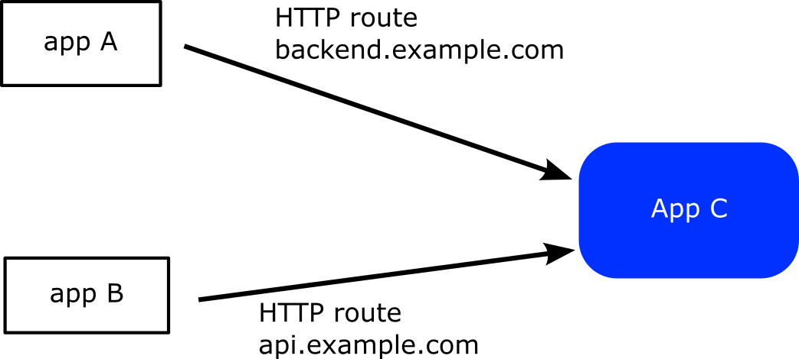

# Using Multiple Routes

The Gateway plugin can control more than one HTTP routes during a canary.
This is a very common scenario if you have micro-services and the same application can be accessed by different routes.




As an  example you have application A that uses application C at `backend.example.com` while application B also depends on C but this time as `api.example.com`

You want to perform a canary deployment for application C so it is crucial that during the canary both HTTP routes change weights.

First you define the two HTTP routes

```yaml
---
kind: HTTPRoute
apiVersion: gateway.networking.k8s.io/v1beta1
metadata:
  name: backend-route
  namespace: default
spec:
  parentRefs:
    - name: eg
  hostnames:
    - backend.example.com
  rules:
  - matches:
    - path:
        type: PathPrefix
        value: /
    backendRefs:
    - name: argo-rollouts-stable-service
      kind: Service
      port: 80
    - name: argo-rollouts-canary-service
      kind: Service
      port: 80
---
kind: HTTPRoute
apiVersion: gateway.networking.k8s.io/v1beta1
metadata:
  name: api-route
  namespace: default
spec:
  parentRefs:
    - name: eg
  hostnames:
    - api.example.com
  rules:
  - matches:
    - path:
        type: PathPrefix
        value: /
    backendRefs:
    - name: argo-rollouts-stable-service
      kind: Service
      port: 80
    - name: argo-rollouts-canary-service
      kind: Service
      port: 80
```

Then in your Rollout definition you use the `httproutes` property that
accepts a list of routes to be controlled.

```yaml
apiVersion: argoproj.io/v1alpha1
kind: Rollout
metadata:
  name: rollouts-demo
  namespace: default
spec:
  replicas: 5
  strategy:
    canary:
      canaryService: argo-rollouts-canary-service
      stableService: argo-rollouts-stable-service
      trafficRouting:
        plugins:
          argoproj-labs/gatewayAPI:
            httpRoutes:
              - name: backend-route
              - name: api-route
            namespace: default # Optional: defaults to rollout namespace
      steps:
      - setWeight: 10
      - pause: {}
      - setWeight: 50
      - pause: {}
      - setWeight: 100
      - pause: {}
  revisionHistoryLimit: 2
  selector:
    matchLabels:
      app: rollouts-demo
  template:
    metadata:
      labels:
        app: rollouts-demo
    spec:
      containers:
        - name: rollouts-demo
          image: <my-image:my-tag>
          ports:
            - name: http
              containerPort: 8080
              protocol: TCP
```

If you now start a canary deployment both routes will change to 10%, 50% and 100% as the canary progresses to all its steps.

## Working with GitOps controllers

GitOps tools such as Argo CD continuously reconcile Gateway API resources and can revert the weight changes that occur while a
canary is progressing. Configure your GitOps policy to ignore those weights.

The plugin also adds the label `rollouts.argoproj.io/gatewayapi-canary=in-progress` to every
HTTPRoute/GRPCRoute/TCPRoute/TLSRoute it mutates, and removes it as soon as the stable service returns to 100% weight. This
label was added so that GitOps controllers could key an "ignore this resource" rule off it. **It cannot do that with Argo CD**
— see [why the in-progress label does not work](#why-the-in-progress-label-does-not-work) below. It is still emitted for
backwards compatibility; if you have no other use for it, set `disableInProgressLabel: true`. The key and value can be changed
with `inProgressLabelKey` and `inProgressLabelValue`.

### Argo CD `ignoreDifferences`

Ignore the weights directly. The expression is unconditional, so Argo CD evaluates it identically against the live object and
the desired one.

On an Argo CD Application:

```yaml
spec:
  ignoreDifferences:
    - group: gateway.networking.k8s.io
      kind: HTTPRoute
      jqPathExpressions:
        - .spec.rules[].backendRefs[].weight
```

Or globally, through the Argo CD Helm chart:

```yaml
configs:
  cm:
    resource.customizations.ignoreDifferences.gateway.networking.k8s.io_HTTPRoute: |
      jqPathExpressions:
        - .spec.rules[].backendRefs[].weight
```

Duplicate the block for `GRPCRoute`, `TCPRoute` and `TLSRoute` if you manage those kinds as well.

This ignores only the weight values, which the plugin owns. Everything else about your rules — matches, backendRef names,
hostnames — stays under Argo CD's control.

Two things to watch for:

- **Write the weights explicitly in the manifests you commit.** If git omits `backendRefs[].weight`, the API server defaults it
  to `1` and Argo CD reports a permanent `OutOfSync` that has nothing to do with the canary. The same applies to
  `parentRefs[].group`/`kind` and `backendRefs[].group`.
- **If you also use header-based routing**, the plugin injects whole rules rather than editing weights, so you need the
  additional rule-name expression documented in [header-based routing](header-based-routing.md).

### Why the in-progress label does not work

Keying the ignore off the in-progress label is what the label was originally added for, and it is what earlier versions of this
documentation recommended:

```yaml
# Do not use this
jqPathExpressions:
  - select(.metadata.labels["rollouts.argoproj.io/gatewayapi-canary"] == "in-progress") | .spec.rules
```

Argo CD evaluates `jqPathExpressions` separately against the live object and the desired (git) object. The plugin applies the
label at runtime, so it exists only on the live object:

| | label present | `select(...)` matches | `.spec.rules` removed |
|---|---|---|---|
| live | yes | yes | yes |
| desired (git) | no | no | no |

Argo CD therefore compares a rules-less live object against a rules-present desired object, and reports a difference that no
sync can resolve — even when the two are otherwise identical.

The same mismatch applies when Argo CD builds the object to apply, so nothing protects the weights at apply time either. A sync
landing while a canary is running writes the git weights back over the ones the plugin set. The Rollout continues to report its
intended weight while the canary actually receives no traffic, and the plugin does not restore the weights because it only
writes to the route during a Rollout reconcile. `ServerSideApply=true` and `RespectIgnoreDifferences=true` do not prevent this.

Any expression that keys on a live-only field has this problem, so customising `inProgressLabelKey` or `inProgressLabelValue`
does not help. The label is applied by the plugin at runtime and by definition never appears in the manifests you commit, so
there is no way to make the two sides of the comparison agree. Use the weight expression above instead.

!!! note
    `managedFieldsManagers: [gatewayAPI]` looks like an appealing alternative, and it does keep the Application in sync. Avoid
    it anyway: the plugin mutates routes with a full-object update, so it owns the whole of `.spec.rules`, and Argo CD would
    stop reporting drift in your routing rules entirely — permanently, not just during a canary.

## Automatic Route Discovery with Label Selectors

Instead of explicitly listing each route name, you can use label selectors to automatically discover routes. This is particularly useful when managing many routes or when routes are created dynamically.

### Using Label Selectors

You can configure the plugin to discover routes based on their labels:

```yaml
apiVersion: argoproj.io/v1alpha1
kind: Rollout
metadata:
  name: rollouts-demo
  namespace: default
spec:
  replicas: 5
  strategy:
    canary:
      canaryService: argo-rollouts-canary-service
      stableService: argo-rollouts-stable-service
      trafficRouting:
        plugins:
          argoproj-labs/gatewayAPI:
            httpRouteSelector:
              matchLabels:
                app: my-app
                canary-enabled: "true"
            namespace: default # Optional: defaults to rollout namespace
      steps:
      - setWeight: 10
      - pause: {}
      - setWeight: 50
      - pause: {}
      - setWeight: 100
      - pause: {}
  # ... rest of rollout spec
```

With this configuration, the plugin will automatically discover and manage all HTTPRoutes in the namespace that have the labels `app: my-app` and `canary-enabled: true`.

### Labeling Your Routes

To use label selectors, add appropriate labels to your routes:

```yaml
---
kind: HTTPRoute
apiVersion: gateway.networking.k8s.io/v1beta1
metadata:
  name: backend-route
  namespace: default
  labels:
    app: my-app
    canary-enabled: "true"
spec:
  # ... route specification
---
kind: HTTPRoute
apiVersion: gateway.networking.k8s.io/v1beta1
metadata:
  name: api-route
  namespace: default
  labels:
    app: my-app
    canary-enabled: "true"
spec:
  # ... route specification
```

### Combining Explicit Routes and Selectors

You can combine both approaches - explicitly named routes and label selectors:

```yaml
trafficRouting:
  plugins:
    argoproj-labs/gatewayAPI:
      httpRoutes:
        - name: critical-route  # Explicitly managed
      httpRouteSelector:        # Plus all routes matching this selector
        matchLabels:
          auto-discover: "true"
      namespace: default # Optional: defaults to rollout namespace
```

### Selector Types

The plugin supports selectors for different route types:

- `httpRouteSelector`: Discovers HTTPRoutes
- `grpcRouteSelector`: Discovers GRPCRoutes
- `tcpRouteSelector`: Discovers TCPRoutes

You can use multiple selectors simultaneously:

```yaml
trafficRouting:
  plugins:
    argoproj-labs/gatewayAPI:
      httpRouteSelector:
        matchLabels:
          protocol: http
      grpcRouteSelector:
        matchLabels:
          protocol: grpc
      namespace: default # Optional: defaults to rollout namespace
```

### Advanced Selectors

You can use more complex label selectors with match expressions:

```yaml
httpRouteSelector:
  matchLabels:
    app: my-app
  matchExpressions:
  - key: environment
    operator: In
    values: ["production", "staging"]
  - key: team
    operator: Exists
```

This selector will match routes that:
- Have the label `app: my-app`
- Have an `environment` label with value `production` or `staging`
- Have any `team` label (regardless of value)

### Verifying Route Discovery

To verify which routes will be discovered by your selector, use kubectl:

```bash
kubectl get httproutes -n default -l app=my-app,canary-enabled=true
```

The plugin logs discovered routes during reconciliation, which can help with debugging.
