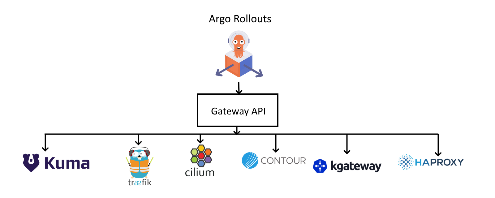

# Progressive Delivery with the Kubernetes Gateway API

[Argo Rollouts](https://argoproj.github.io/rollouts/) is a progressive delivery controller for Kubernetes. It supports several advanced deployment methods such as [blue/green](https://argo-rollouts.readthedocs.io/en/stable/features/bluegreen/) and [canaries](https://argo-rollouts.readthedocs.io/en/stable/features/canary/).

For canary deployments Argo Rollouts can optionally use [a traffic provider](https://argoproj.github.io/argo-rollouts/features/traffic-management/) to split traffic between pods with full control and in a gradual way.

Until recently adding a new traffic provider to Argo Rollouts needed ad-hoc support code. With the adoption of the [Gateway API](https://gateway-api.sigs.k8s.io/), the integration becomes much easier as any traffic provider that implements the API will automatically be supported by Argo Rollouts.

## The Kubernetes Gateway API

The Gateway API is an open source project managed by the [SIG-NETWORK](https://github.com/kubernetes/community/tree/master/sig-network) community. It is a collection of resources that model service networking in Kubernetes.

See a [list of current projects](https://gateway-api.sigs.k8s.io/implementations/) that support the API.

## Prerequisites

You need the following

1. A Kubernetes cluster
2. An [installation](https://argoproj.github.io/argo-rollouts/installation/) of the Argo Rollouts controller
3. A traffic provider that [supports the Gateway API](https://gateway-api.sigs.k8s.io/implementations/)
4. An [installation of the Gateway plugin](installation.md)

Once everything is ready you need to create [a Rollout resource](https://argoproj.github.io/argo-rollouts/features/specification/) for all workloads that will use the integration.

## How to use the Gateway API with Argo Rollouts

This is the installation process.

1. Enable Gateway Provider and create Gateway entrypoint
1. Create GatewayClass and Gateway resources
1. Create cluster entrypoint and map it with our Gateway entrypoint
1. Install Argo Rollouts in your cluster along with the Gateway API plugin
1. Create an HTTPRoute
1. Create canary and stable services
1. Create your Rollout resources
1. Start a deployment

The first 3 steps are specific to your provider/implementation of the Gateway API inside the Kubernetes cluster. The rest of the steps are the same regardless of the specific implementation you chose.

See end-to-end examples for several other implementations
at the [provider status page](provider-status.md) or try our [quick start guide](quick-start.md).

