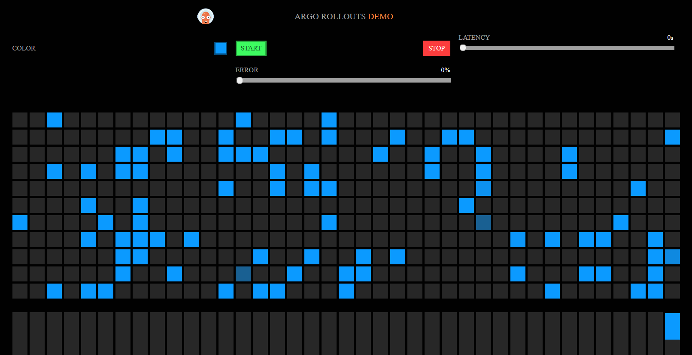
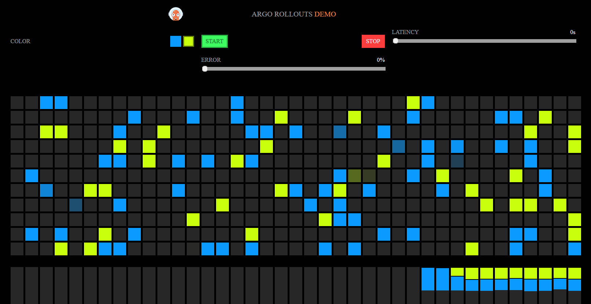
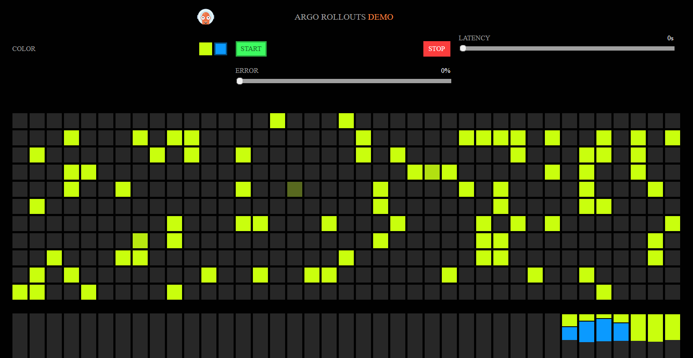

# Quick start for using Kubernetes API Gateway with Argo Rollouts

Let's look at a quick example of how you can use Argo Rollouts
to control your Http Routes. In this guide we will see how to use [the Rollouts demo](https://github.com/argoproj/rollouts-demo) with [Envoy Gateway](https://gateway.envoyproxy.io/) as the traffic provider.

You can find more examples at the [provider status page](provider-status.md).

## Prerequisites

Get access to a Kubernetes cluster. You can use a cluster on the cloud or on your workstation like [k3s](https://k3s.io/), [k3d](https://k3d.io/) or [Docker for Desktop](https://www.docker.com/products/docker-desktop/).

Then make sure you also install:

 1. Argo Rollouts along [with the Gateway plugin](installation.md)
 1. The [helm](https://helm.sh/) and [kubectl](https://kubernetes.io/docs/tasks/tools/) executables
 1. The [Argo Rollouts CLI](https://argo-rollouts.readthedocs.io/en/stable/features/kubectl-plugin/)

In a real production scenario, [different people](https://gateway-api.sigs.k8s.io/#personas) will build
different parts of the solution. In this guide you will wear multiple hats, so the process might seem more complicated than it actually is.

## Step 1 - Install the Gateway Provider

!!! note
    This process needs to happen only once per cluster. The task is normally handled by infrastructure operators.

Install Envoy Gateway with Helm:

```
helm install eg oci://docker.io/envoyproxy/gateway-helm --version v0.5.0 -n envoy-gateway-system --create-namespace
```

Wait for it to become ready

```
kubectl wait --timeout=5m -n envoy-gateway-system deployment/envoy-gateway --for=condition=Available
```

## Step 2 - Create a gateway

!!! note
    This process needs to happen only once per cluster. The task is normally handled by infrastructure operators.

Create a Gateway

```yaml
---
apiVersion: gateway.networking.k8s.io/v1beta1
kind: GatewayClass
metadata:
  name: eg
spec:
  controllerName: gateway.envoyproxy.io/gatewayclass-controller
---
apiVersion: gateway.networking.k8s.io/v1beta1
kind: Gateway
metadata:
  name: eg
  namespace: default
spec:
  gatewayClassName: eg
  listeners:
    - name: http
      protocol: HTTP
      port: 80
```
Apply the file with kubectl and then verify it works correctly with

```
kubectl get gatewayclass
kubectl get gateway
```

Note down the `ADDRESS` IP to use later in the application. For a local cluster this should be `127.0.0.1`

## Step 3 - Allow Argo Rollouts to edit Http Routes

!!! note
    This process needs to happen only once per cluster. The task is normally handled by infrastructure operators.

Create a role and binding.

```yaml
---
apiVersion: rbac.authorization.k8s.io/v1
kind: ClusterRole
metadata:
  name: gateway-controller-role
rules:
  - apiGroups:
      - gateway.networking.k8s.io
    resources:
      - httproutes
    verbs:
      - get
      - patch
      - update
---
apiVersion: rbac.authorization.k8s.io/v1
kind: ClusterRoleBinding
metadata:
  name: gateway-admin
roleRef:
  apiGroup: rbac.authorization.k8s.io
  kind: ClusterRole
  name: gateway-controller-role
subjects:
  - namespace: argo-rollouts
    kind: ServiceAccount
    name: argo-rollouts
```

Apply the file with kubectl. Note that this role is **NOT** to be used in production clusters as it is super permissive.


## Step 4 - Create an HTTP route

!!! note
    This process needs to happen only once per application. The task is normally handled by cluster operators or application developers.

Create a route that has as backend two services (stable and canary)

```yaml
---
kind: HTTPRoute
apiVersion: gateway.networking.k8s.io/v1beta1
metadata:
  name: argo-rollouts-http-route
  namespace: default
spec:
  parentRefs:
    - name: eg
  rules:
  - matches:
    - path:
        type: PathPrefix
        value: /
    backendRefs:
    - name: argo-rollouts-stable-service
      kind: Service
      port: 80
    - name: argo-rollouts-canary-service
      kind: Service
      port: 80
```

Apply the file with kubectl.
Verify it with `kubectl get httproutes`

## Step 5 - Create a Rollout

!!! note
    This process needs to happen only once per application. The task is normally handled by cluster operators or application developers.

Create two Kubernetes services

```yaml
---
apiVersion: v1
kind: Service
metadata:
  name: argo-rollouts-stable-service
  namespace: default
spec:
  ports:
    - port: 80
      targetPort: http
      protocol: TCP
      name: http
  selector:
    app: rollouts-demo
---
apiVersion: v1
kind: Service
metadata:
  name: argo-rollouts-canary-service
  namespace: default
spec:
  ports:
    - port: 80
      targetPort: http
      protocol: TCP
      name: http
  selector:
    app: rollouts-demo
```

Apply the file with kubectl.

Finally create the Rollout:

```yaml
apiVersion: argoproj.io/v1alpha1
kind: Rollout
metadata:
  name: rollouts-demo
  namespace: default
spec:
  replicas: 10
  strategy:
    canary:
      canaryService: argo-rollouts-canary-service # our created canary service
      stableService: argo-rollouts-stable-service # our created stable service
      trafficRouting:
        plugins:
          argoproj-labs/gatewayAPI:
            httpRoute: argo-rollouts-http-route # our created httproute
            namespace: default
            # Optional: customize or disable the temporary label that marks routes as managed during a canary
            # inProgressLabelKey: rollouts.argoproj.io/gatewayapi-canary
            # inProgressLabelValue: in-progress
            # disableInProgressLabel: false
      steps:
      - setWeight: 50
      - pause: {}
      - setWeight: 100
      - pause: {}
  revisionHistoryLimit: 2
  selector:
    matchLabels:
      app: rollouts-demo
  template:
    metadata:
      labels:
        app: rollouts-demo
    spec:
      containers:
        - name: rollouts-demo
          image: argoproj/rollouts-demo:blue
          ports:
            - name: http
              containerPort: 8080
              protocol: TCP
          resources:
            requests:
              memory: 32Mi
              cpu: 5m
```

Wait for the application to be ready and then visit in your browser `localhost`, or `127.0.0.1` or whatever is the IP of your Gateway.

You should see that all requests return with blue color:




## Daily Task - Perform a Canary

!!! note
    This process happens multiple times per day/week. The task is normally handled by application developers.

We are ready to deploy a new version. Open your rollout yaml change the image to `argoproj/rollouts-demo:yellow` and apply the file again with kubectl.

Wait until the canary pod are ready. Run the following to see when the canary has paused.

```
kubectl argo rollouts get rollout rollouts-demo
```

At this point each color should get 50% of requests. You can see this visually in your browser:



You should also inspect the Http Route and verify that Argo Rollouts has changed the weights of the backend services

Run

```
kubectl get httproute -o yaml
```

In the response you should see the following information about the weights for each backing service.

!!! info
    While the canary is running, the plugin adds the label `rollouts.argoproj.io/gatewayapi-canary=in-progress` to every managed
    Gateway API route so that GitOps tools such as Argo CD can be configured to ignore those temporary changes. The label is
    removed automatically once the stable service goes back to 100% weight. Use `disableInProgressLabel`, `inProgressLabelKey`
    or `inProgressLabelValue` if you need to adjust this behaviour.

    **Argo CD example (Helm chart values)**

    ```yaml
    configs:
      cm:
        resource.customizations.ignoreDifferences.gateway.networking.k8s.io_HTTPRoute: |
          jqPathExpressions:
            - if .metadata.labels["rollouts.argoproj.io/gatewayapi-canary"] == "in-progress" then .spec.rules
    ```

    Apply the same snippet to `GRPCRoute`, `TCPRoute` and `TLSRoute` kinds if you manage them. If you configure `resource.customizations`
    directly inside an Application manifest rather than Helm values, reuse the same structure under `spec.source.plugin` or
    `spec.source.helm.values`.

```yaml
[...snip...]
  spec:
    parentRefs:
    - group: gateway.networking.k8s.io
      kind: Gateway
      name: eg
    rules:
    - backendRefs:
      - group: ""
        kind: Service
        name: argo-rollouts-stable-service
        port: 80
        weight: 50
      - group: ""
        kind: Service
        name: argo-rollouts-canary-service
        port: 80
        weight: 50
      matches:
      - path:
          type: PathPrefix
          value: /
[...snip...]
```

Promote the Rollout twice by running the following two times:

```
kubectl argo rollouts promote rollouts-demo
```

Wait a bit until the old color pods are completely destroyed.
The application should gradually change now to yellow.



The deployment has finished. If you change the Rollout image again, the process will start over.

Feel free to learn more about all Rollout options in the [Specification documentation](https://argo-rollouts.readthedocs.io/en/stable/features/specification/).
