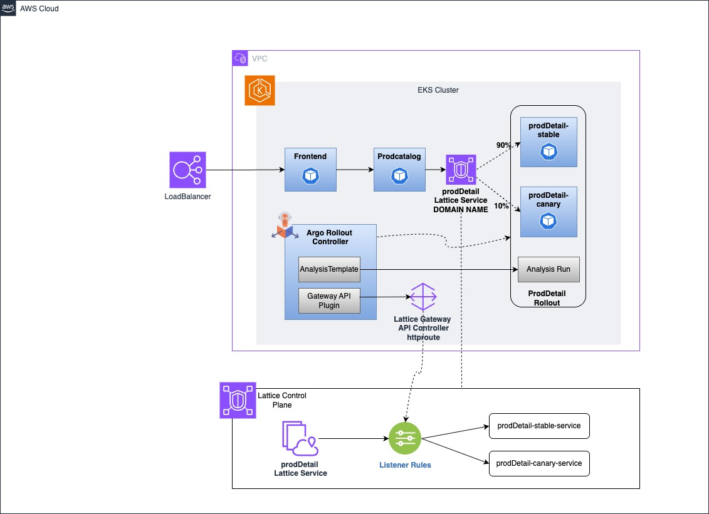

# Argo Rollout with AWS Gateway API Controller for Amazon VPC Lattice

This guide walks through the process of setting up Amazon VPC Lattice with Gateway API Controller in a Kubernetes environment running on AWS, along with Argo Rollouts for advanced deployment strategies. The implementation is based on a polyglot microservice application, demonstrating service-to-service connectivity, traffic management, and canary deployments.

## Table of Contents

- [What is Amazon VPC Lattice?](#what-is-amazon-vpc-lattice)
- [What is AWS Gateway API Controller for Lattice?](#what-is-aws-gateway-api-controller-for-lattice)
- [Architecture Overview](#architecture-overview)
- [Prerequisites](#prerequisites)
- [Setup Instructions](#setup-instructions)
  - [Create Cluster](#create-cluster)
  - [Prepare for Lattice Gateway API Controller](#prepare-for-lattice-gateway-api-controller)
    - [Set up environment variables and configure security groups](#set-up-environment-variables-and-configure-security-groups-so-that-they-allow-all-pods-communicating-with-vpc-lattice-to-allow-traffic-from-the-vpc-lattice-managed-prefix-lists)
    - [Setup IAM Permissions](#setup-iam-permissions)
    - [Deploy Gateway API CRDs](#deploy-gateway-api-crds)
  - [Install the Gateway API Controller using Helm](#install-the-gateway-api-controller-using-helm)
  - [Deploy Gateway Class](#deploy-gateway-class)
  - [Install Argo Rollout](#install-argo-rollout)
  - [Install Gateway API Plugin in ArgoRollout](#install-gateway-api-plugin-in-argorollout)
  - [Create Gateway](#create-gateway)
  - [Deploy Applications](#deploy-applications)
- [References](#references)


## What is Amazon VPC Lattice?

Amazon VPC Lattice is an application networking service that connects, secures, and monitors services across multiple AWS accounts and VPCs. It simplifies service-to-service connectivity without complex networking configurations, automatically scales to handle varying traffic loads, and provides consistent security controls across all service communications.

## What is AWS Gateway API Controller for Lattice?

AWS Gateway API Controller for Lattice is an implementation of the Kubernetes Gateway API that integrates with Amazon VPC Lattice. It provides a Kubernetes-native way to manage service networking using standard Kubernetes APIs. The controller watches for Gateway API resources and automatically provisions corresponding VPC Lattice objects, eliminating the need to write custom code or manage sidecar proxies.

## Architecture Overview

The following diagram illustrates the architecture of our polyglot microservice application using AWS VPC Lattice with Gateway API Controller and Argo Rollouts:



This implementation demonstrates how to use AWS VPC Lattice and Gateway API Controller to connect and manage traffic between microservices written in different programming languages, while leveraging Argo Rollouts for advanced deployment strategies like canary deployments.

A key component of this architecture is the Argo Rollouts Gateway API plugin, which enables Argo Rollouts to interact directly with HTTProute resources. This integration allows for dynamic traffic shifting during canary deployments by modifying the HTTProute configurations. When a rollout is initiated, the plugin updates the weight distributions in the HTTProute file, gradually shifting traffic from the stable version to the canary version based on the defined rollout strategy. This provides fine-grained control over traffic management without requiring manual intervention or custom scripting.

## Prerequisites

Before starting the setup, ensure you have:

- AWS CLI configured with appropriate permissions
- `kubectl` installed
- `eksctl` installed
- `helm` installed
- `jq` installed

## Setup Instructions

### Create Cluster

Create an EKS cluster using eksctl:

```bash
eksctl create cluster --name <clustername> --enable-auto-mode --region <regioncode>
```

### Prepare for Lattice Gateway API Controller

#### Set up environment variables and configure security groups so that they allow all Pods communicating with VPC Lattice to allow traffic from the VPC Lattice managed prefix lists

```bash
export AWS_REGION=<RegionCode>
export CLUSTER_NAME=<ClusterName>
export ACCOUNT_ID=<YourAWSAccountID>
export EKSVPC=<VPCIdOfEKSCluster>
export LATTICE_SVC_NET=<NameForLatticeService>

# EXAMPLE Variable
# export AWS_REGION=ap-southeast-1
# export CLUSTER_NAME=lattice-canary
# export ACCOUNT_ID=<YourAWSAccountID>
# export EKSVPC=<VPCIdOfEKSCluster>
# export LATTICE_SVC_NET=latcansvcnet

CLUSTER_SG=$(aws eks describe-cluster --name $CLUSTER_NAME --output json| jq -r '.cluster.resourcesVpcConfig.clusterSecurityGroupId')
PREFIX_LIST_ID=$(aws ec2 describe-managed-prefix-lists --query "PrefixLists[?PrefixListName=="\'com.amazonaws.$AWS_REGION.vpc-lattice\'"].PrefixListId" | jq -r '.[]')
aws ec2 authorize-security-group-ingress --group-id $CLUSTER_SG --ip-permissions "PrefixListIds=[{PrefixListId=${PREFIX_LIST_ID}}],IpProtocol=-1"
PREFIX_LIST_ID_IPV6=$(aws ec2 describe-managed-prefix-lists --query "PrefixLists[?PrefixListName=="\'com.amazonaws.$AWS_REGION.ipv6.vpc-lattice\'"].PrefixListId" | jq -r '.[]')
aws ec2 authorize-security-group-ingress --group-id $CLUSTER_SG --ip-permissions "PrefixListIds=[{PrefixListId=${PREFIX_LIST_ID_IPV6}}],IpProtocol=-1"
```

#### Setup IAM Permissions:

```bash
curl https://raw.githubusercontent.com/aws/aws-application-networking-k8s/main/files/controller-installation/recommended-inline-policy.json -o recommended-inline-policy.json

aws iam create-policy \
    --policy-name VPCLatticeControllerIAMPolicy \
    --policy-document file://recommended-inline-policy.json

export VPCLatticeControllerIAMPolicyArn=$(aws iam list-policies --query 'Policies[?PolicyName==`VPCLatticeControllerIAMPolicy`].Arn' --output text)
```

#### Deploy Gateway API CRDs

Download and apply the Gateway API Custom Resource Definitions:

```bash
wget https://github.com/kubernetes-sigs/gateway-api/releases/download/v1.3.0/standard-install.yaml

kubectl create -f standard-install.yaml
```

Download and apply the namespace configuration:

```bash
wget https://raw.githubusercontent.com/aws/aws-application-networking-k8s/main/files/controller-installation/deploy-namesystem.yaml

kubectl create -f deploy-namesystem.yaml
```

Create a service account for the controller:

```bash
cat >gateway-api-controller-service-account.yaml <<EOF
apiVersion: v1
kind: ServiceAccount
metadata:
    name: gateway-api-controller
    namespace: aws-application-networking-system
EOF
kubectl apply -f gateway-api-controller-service-account.yaml
```

Create the trust relationship for IAM role:

```bash
cat >trust-relationship.json <<EOF
{
    "Version": "2012-10-17",
    "Statement": [
        {
            "Sid": "AllowEksAuthToAssumeRoleForPodIdentity",
            "Effect": "Allow",
            "Principal": {
                "Service": "pods.eks.amazonaws.com"
            },
            "Action": [
                "sts:AssumeRole",
                "sts:TagSession"
            ]
        }
    ]
}
EOF
```

Create and configure the IAM role:

```bash
aws iam create-role --role-name VPCLatticeControllerIAMRole --assume-role-policy-document file://trust-relationship.json --description "IAM Role for AWS Gateway API Controller for VPC Lattice"

aws iam attach-role-policy --role-name VPCLatticeControllerIAMRole --policy-arn=$VPCLatticeControllerIAMPolicyArn

export VPCLatticeControllerIAMRoleArn=$(aws iam list-roles --query 'Roles[?RoleName==`VPCLatticeControllerIAMRole`].Arn' --output text)

aws eks create-pod-identity-association --cluster-name $CLUSTER_NAME --role-arn $VPCLatticeControllerIAMRoleArn --namespace aws-application-networking-system --service-account gateway-api-controller
```

### Install the Gateway API Controller using Helm:

```bash
aws ecr-public get-login-password --region us-east-1 | helm registry login --username AWS --password-stdin public.ecr.aws

helm install gateway-api-controller \
   oci://public.ecr.aws/aws-application-networking-k8s/aws-gateway-controller-chart \
   --version=v1.1.2 \
   --set=serviceAccount.create=false --namespace aws-application-networking-system \
   --set=log.level=info \
   --set=awsRegion=$AWS_REGION \
   --set=clusterVpcId=$EKSVPC \
   --set=awsAccountId=$ACCOUNT \
   --set=clusterName=$CLUSTER_NAME \
   --set=defaultServiceNetwork=$LATTICE_SVC_NET
```

### Deploy Gateway Class

Download and apply the Gateway Class configuration:

```bash
wget https://raw.githubusercontent.com/aws/aws-application-networking-k8s/main/files/controller-installation/gatewayclass.yaml

kubectl create -f gatewayclass.yaml
```

### Install Argo Rollout

You can use the instructions mentioned [here](https://argo-rollouts.readthedocs.io/en/stable/installation/#controller-installation)

Create a namespace and install Argo Rollouts:

```bash
kubectl create namespace argo-rollouts

kubectl apply -n argo-rollouts -f https://github.com/argoproj/argo-rollouts/releases/latest/download/install.yaml
```

Patch the deployment to include AWS region:

```bash
kubectl patch deployment argo-rollouts -n argo-rollouts \
  --type='json' \
  -p='[{"op": "add", "path": "/spec/template/spec/containers/0/env", "value": [{"name": "AWS_REGION", "value": "'$AWS_REGION'"}]}]'
```

Install the Argo Rollouts CLI, as mentioned [here](https://argo-rollouts.readthedocs.io/en/stable/installation/#controller-installation)

```bash
brew install argoproj/tap/kubectl-argo-rollouts
```

### Install Gateway API Plugin in ArgoRollout

You can follow the instruction [here](https://rollouts-plugin-trafficrouter-gatewayapi.readthedocs.io/en/latest/installation/#installing-the-plugin-via-https)

Apply the configuration and restart the deployment:

```bash
kubectl apply -f configmap-gatewayapicontrollerforargo.yaml
# Give Access to Argo Rollouts for the Gateway/HTTP Route. Do Note thatthese permissions are not very strict. You should lock them down according to your needs.
kubectl create -f ClusterRoleForArgoGatewayAPI.yaml
# Restart the Argo Rollout Controller
kubectl rollout restart deployment -n argo-rollouts argo-rollouts
```

### Create Gateway

Create the Gateway and related resources for 'proddetail' service:

```bash
kubectl create -f gateway.yaml
kubectl create -f httproute.yaml
kubectl create -f proddetails-lat-svc.yaml
kubectl create -f proddetail-tgp.yaml

# Check VPC Lattice generated DNS Address for HTTPRoute 'latcan-app-default'. Lattice provide the name of lattice service as httproutename-namespace, hence latcan-app-default
latcanFQDN=$(kubectl get httproute latcan-app-default -o json | jq -r '.metadata.annotations."application-networking.k8s.aws/lattice-assigned-domain-name"')
echo $latcanFQDN
```

### Deploy Applications

Deploy the frontend, product catalog, and proddetail rollout:

```bash
# Note: Take the domain name of latcan-app-default, as in output of $latcanFQDN and put into the variable of prodcatalogdep.yaml file AGG_APP_URL value
kubectl create -f frontenddep.yaml
kubectl create -f frontendsvc.yaml
kubectl create -f prodcatalogdep.yaml
kubectl create -f prodcatalogsvc.yaml
kubectl create -f proddetail-rollout.yaml
```
Check the Argo Rollout Status
```bash
kubectl argo rollouts get rollout proddetail -n workshop

Name:            proddetail
Namespace:       workshop
Status:          ✔ Healthy
Strategy:        Canary
  Step:          9/9
  SetWeight:     100
  ActualWeight:  100
Images:          nicksrj/product_detail:1.0 (stable)
Replicas:
  Desired:       1
  Current:       1
  Updated:       1
  Ready:         1
  Available:     1

NAME                                    KIND        STATUS     AGE  INFO
⟳ proddetail                            Rollout     ✔ Healthy  19s  
└──# revision:1                                                     
   └──⧉ proddetail-75b89f79bd           ReplicaSet  ✔ Healthy  19s  stable
      └──□ proddetail-75b89f79bd-hk98b  Pod         ✔ Running  19s  ready:1/1

```

If you hit the ELB DNS created using frontend_node svc, you will get the image which shows "Vendors : ABC.com" 

Update the image for the rollout:

```bash
kubectl argo rollouts set image proddetail "*=975050187486.dkr.ecr.ap-southeast-1.amazonaws.com/niksrj/proddetail" -n workshop

kubectl argo rollouts get rollout proddetail -n workshop
Name:            proddetail
Namespace:       workshop
Status:          ॥ Paused
Message:         CanaryPauseStep
Strategy:        Canary
  Step:          1/9
  SetWeight:     20
  ActualWeight:  20
Images:          nicksrj/product_detail:1.0 (stable)
                 nicksrj/product_detail:2.0 (canary)
Replicas:
  Desired:       1
  Current:       2
  Updated:       1
  Ready:         2
  Available:     2

NAME                                    KIND        STATUS     AGE    INFO
⟳ proddetail                            Rollout     ॥ Paused   5m54s  
├──# revision:2                                                       
│  └──⧉ proddetail-5d66bbc795           ReplicaSet  ✔ Healthy  73s    canary
│     └──□ proddetail-5d66bbc795-t9gsx  Pod         ✔ Running  73s    ready:1/1
└──# revision:1                                                       
   └──⧉ proddetail-75b89f79bd           ReplicaSet  ✔ Healthy  5m54s  stable
      └──□ proddetail-75b89f79bd-hk98b  Pod         ✔ Running  5m54s  ready:1/1
```
Now if you hit the same ELB DNS , you will get the image which shows "Vendors : ABC.com,XYZ.com". So basically XYZ.com is coming from the 2.0 image of product_detail. 
